# **NYC Motor Vehicle Collisions & Weather Data Integration (2013–2023)**  

**[📊 View the final interactive Tableau dashboard →](https://public.tableau.com/app/profile/jeremymenes/viz/NYCCollisions_17336129497660/Dashboard2?publish=yes)**  


## **Executive Summary**

This project integrates over **2 million NYC motor vehicle collision records** with **300,000+ NOAA weather observations** (2013–2023) to quantify environmental influences on traffic incidents. Through a combination of **SQL-based data cleaning**, **Python geospatial matching (Haversine distance)**, and **robust imputation strategies**, I built a complete, analysis-ready dataset with **100% weather coverage** that powers an interactive Tableau dashboard revealing temporal and spatial collision trends.

---

## **Project Objective**

This project combines **New York City’s Motor Vehicle Collisions dataset** with **NOAA historical weather records** to investigate environmental factors contributing to traffic accidents over a ten-year period.  

The focus is on:
- **Advanced data preparation and integration** using SQL and Python.  
- **Geospatial matching** of collisions to weather stations.  
- **Data quality assurance** through completeness thresholds and targeted imputation.  
- **Creation of an analysis-ready dataset** for visualization in Tableau.  

---

## **Data Sources & Scope**

**NYC Motor Vehicle Collisions**  
- **Source:** [NYC OpenData](https://data.cityofnewyork.us/Public-Safety/Motor-Vehicle-Collisions-Crashes/h9gi-nx95/about_data)  
- ~2 million rows, one per collision, covering all five boroughs (2013–2023).  
- Includes geospatial coordinates, timestamps, and contributing factors.  

**NOAA Historical Weather Data**  
- **Source:** [NOAA NCEI](https://www.ncdc.noaa.gov/cdo-web/datasets)  
- ~300,000 daily weather readings from 220 regional stations.  
- Metrics: Temperature (min/max/avg), precipitation, snowfall, snow depth, and event flags (fog, thunder, hail, etc.).  

---

## **Data Preparation Workflow Overview**

The ETL process involved three major phases:

1. **Data Cleaning & Standardization in SQL**  
   - Resolved missing values, standardized formats, and corrected inconsistencies directly in the database environment.  

2. **Weather Data Integration in Python**  
   - Filtered NOAA stations by completeness.  
   - Performed **nearest-station matching** using great-circle distances for each collision record.  

3. **Imputation of Remaining Missing Data**  
   - Filled in weather data for collisions without coordinates by averaging readings across all available stations for that date.  

---

### **ETL Workflow Diagram**

```mermaid
flowchart LR
    A["NYC Collision Dataset<br>(~2M rows)"] --> B["SQL Cleaning & Standardization"]
    C["NOAA Weather Dataset<br>(~300K rows)"] --> D["Python Completeness Filtering (>=95% coverage)"]
    B --> E["Python Spatial Matching<br>(Haversine Formula)"]
    D --> E
    E --> F["Merge Weather Data into Collision Records"]
    F --> G["SQL Missing Data Imputation<br>(Date-based Averages)"]
    G --> H["Analysis-Ready Dataset →<br>Tableau Visualization"]
```



---

## **Project Highlight – NOAA Data Completeness Filtering**

To ensure data integrity, only stations with ≥95% completeness across key variables (`PRCP`, `TMAX`, `TMIN`, `SNOW`) were used.  

**Process:**
- Group NOAA records by station.  
- Calculate completeness ratios.  
- Filter out stations failing to meet the threshold.  

<details>
<summary>📜 Python Script – Station Completeness Filtering</summary>

```python
import pandas as pd

with open(r"[NOAA_WeatherData.csv", encoding='utf-8-sig') as Weather_table:
    Stations = pd.read_csv(Weather_table)

# Set completeness threshold
completeness_threshold = 0.95
required_columns = ['PRCP', 'TMAX', 'TMIN', 'SNOW']

# Group by station
station_groups = Stations.groupby('NAME')
qualified_stations = []

for station, group in station_groups:
    total_records = len(group)
    complete_records = group[required_columns].dropna().shape[0]
    completeness_ratio = complete_records / total_records if total_records > 0 else 0
    if completeness_ratio >= completeness_threshold:
        qualified_stations.append((station, completeness_ratio))

# Print results
result_df = pd.DataFrame(qualified_stations, columns=['NAME', 'Completeness'])
print(result_df.sort_values(by='Completeness', ascending=False))
```

</details>

**Outcome:**  
The retained stations included NYC’s three major airports and Central Park — all with **100% completeness** — ensuring consistent, reliable data coverage for the analysis.

---

## **Geospatial Integration – Matching Collisions to Weather Stations**

Once the station list was finalized, each collision with valid coordinates was matched to the nearest weather station reporting on that date.  

**Challenges Addressed:**
- Many collisions lacked valid geocoordinates.  
- Spatial matching had to be both **accurate** and **efficient** for 1.75 million records.  
- Smaller stations with incomplete data were excluded to avoid null matches.  

<details>
<summary>📜 Python Script – Nearest Weather Station Matching</summary>

```python
import pandas as pd
import logging
from math import radians, cos, sin, asin, sqrt

logging.basicConfig(level=logging.INFO)
logger = logging.getLogger(__name__)

with open(r"NYC_CollisionsData", encoding='utf-8-sig') as Coll_Table:
    NYCdb = pd.read_csv(Coll_Table)
with open(r"NOAA Weather Data 95perc Accuracy.csv", encoding='utf-8-sig') as Weather_table:
    Stations = pd.read_csv(Weather_table)

NYCdb = NYCdb.rename(columns={'LATITUDE': 'NYCLat', 'LONGITUDE': 'NYCLong'})
Stations = Stations.rename(columns={'LATITUDE': 'StationLat', 'LONGITUDE': 'StationLong'})

NYCdb['CRASH_DATE'] = pd.to_datetime(NYCdb['CRASH_DATE']).dt.date
Stations['DATE'] = pd.to_datetime(Stations['DATE']).dt.date

NYCdb.sort_values(by='CRASH_DATE', inplace=True)
Stations.sort_values(by='DATE', inplace=True)

date_cache = {}

class Coordinates:
    def __init__(self, lat, lon):
        self.lat = radians(lat)
        self.lon = radians(lon)
    def __sub__(self, other):
        diff_lon = self.lon - other.lon
        diff_lat = self.lat - other.lat
        a = sin(diff_lat / 2) ** 2 + cos(other.lat) * cos(self.lat) * sin(diff_lon / 2) ** 2
        c = 2 * asin(sqrt(a))
        return 6371 * c  # Distance in km

def find_nearest_station_by_date(lat, lon, date):
    if date in date_cache:
        stations_on_date = date_cache[date]
    else:
        stations_on_date = Stations[Stations['DATE'] == date]
        date_cache.clear()
        date_cache[date] = stations_on_date
        if stations_on_date.empty or not date:
            return None
    src_coords = Coordinates(lat, lon)
    distances = stations_on_date.apply(
        lambda row: Coordinates(row['StationLat'], row['StationLong']) - src_coords, axis=1)
    closest_idx = distances.idxmin()
    return stations_on_date.loc[closest_idx, 'NAME']

NYCdb['Closest_Station'] = NYCdb.apply(
    lambda row: find_nearest_station_by_date(row['NYCLat'], row['NYCLong'], row['CRASH_DATE']), axis=1)

NYCdb.to_csv("output.csv", index=False, sep=',', encoding='utf-8')
```

</details>

**Outcome:**  
85% of collisions were successfully matched to a high-quality station with valid weather data.

---

## **Handling Missing Data in SQL**

For the remaining 15% of records (those without valid coordinates), weather data was imputed by averaging readings across all available stations for that date.  

Key steps:
1. Replaced null values with placeholders to allow joins on columns that would fail when NULL.  
2. Created a CTE to compute average weather metrics by date for fallback imputation.  
3. Updated the main collision table using those date-based averages where spatial matching was unavailable.  

<details>
<summary>📜 SQL Script – Missing Data Imputation & Weather Data Integration</summary>

```sql
-- Update incomplete weather data in source table in bulk using COALESCE logic for brevity
UPDATE [Over 90 Accurate Weather Data]
SET 
    [High_Winds]    = COALESCE([High_Winds], 0),
    [Precipitation] = COALESCE([Precipitation], 0),
    [Snowfall]      = COALESCE([Snowfall], 0),
    [Snow_Depth]    = COALESCE([Snow_Depth], 0),
    -- If Avg_Temp is missing, compute from Max and Min
    [Avg_Temp]      = CASE 
                         WHEN [Avg_Temp] IS NULL AND [Max_Temp] IS NOT NULL AND [Min_Temp] IS NOT NULL 
                             THEN ([Max_Temp] + [Min_Temp]) / 2 
                         ELSE COALESCE([Avg_Temp], -99) 
                     END,
    [Min_Temp]      = CASE WHEN [Min_Temp] IS NULL THEN -99 ELSE [Min_Temp] END,
    [Max_Temp]      = CASE WHEN [Max_Temp] IS NULL THEN -99 ELSE [Max_Temp] END,
    [Fog]           = COALESCE([Fog], 0),
    [Heavy_Fog]     = COALESCE([Heavy_Fog], 0),
    [Thunder]       = COALESCE([Thunder], 0),
    [Sleet]         = COALESCE([Sleet], 0),
    [Hail]          = COALESCE([Hail], 0),
    [Glaze/Rime]    = COALESCE([Glaze/Rime], 0),
    [Smoke/Haze]    = COALESCE([Smoke/Haze], 0);

-- Add the closest weather station to the collision table (precomputed from Python script)
UPDATE TargetTable
SET TargetTable.Closest_Station = Stations.Closest_Station
FROM [Motor_Vehicle_Collisions_-_Crashes] AS TargetTable
JOIN [CollisionIDs with Closest Weather Station] AS Stations
    ON TargetTable.COLLISION_ID = Stations.COLLISION_ID;

-- Join weather data into collisions based on matched station and date
UPDATE TargetTable
SET 
    TargetTable.[Precipitation] = Weather.[Precipitation],
    TargetTable.[Snowfall] = Weather.[Snowfall],
    TargetTable.[Snow Depth] = Weather.[Snow_Depth],
    TargetTable.[Fog] = Weather.[Fog],
    TargetTable.[Heavy Fog] = Weather.[Heavy_Fog],
    TargetTable.[Thunder] = Weather.[Thunder],
    TargetTable.[Sleet] = Weather.[Sleet],
    TargetTable.[Hail] = Weather.[Hail],
    TargetTable.[Glaze/Rime] = Weather.[Glaze/Rime],
    TargetTable.[Smoke/Haze] = Weather.[Smoke/Haze],
    TargetTable.[HighWinds] = Weather.High_Winds,
    TargetTable.[Avg Temp] = Weather.Avg_Temp,
    TargetTable.[Max Temp] = Weather.Max_Temp,
    TargetTable.[Min Temp] = Weather.Min_Temp
FROM [Motor_Vehicle_Collisions_-_Crashes] AS TargetTable
JOIN [Over 90 Accurate Weather Data] AS Weather
    ON TargetTable.Closest_Station = Weather.NAME
    AND TargetTable.CRASH_DATE = Weather.DATE;

-- Fill remaining NULLs for collisions missing location by applying safe defaults
-- (Temperature uses -99 because 0 is a legitimate reading in NYC)
UPDATE [Motor_Vehicle_Collisions_-_Crashes]
SET [Avg Temp] = -99
WHERE (
        [Avg Temp] IS NULL
        AND [CRASH_DATE] < '2024-01-01 00:00:00.0000000'
        AND [CRASH_DATE] > '2012-12-31 00:00:00.0000000'
        AND LATITUDE > 40
        AND LATITUDE < 41
        AND LONGITUDE > -74.5
        AND LONGITUDE < -73
    )
    OR (
        [Avg Temp] IS NULL
        AND [CRASH_DATE] < '2024-01-01 00:00:00.0000000'
        AND [CRASH_DATE] > '2012-12-31 00:00:00.0000000'
        AND LATITUDE IS NULL
    )
    OR (
        [Avg Temp] IS NULL
        AND [CRASH_DATE] < '2024-01-01 00:00:00.0000000'
        AND [CRASH_DATE] > '2012-12-31 00:00:00.0000000'
        AND LATITUDE = 0
    );

UPDATE [Motor_Vehicle_Collisions_-_Crashes]
SET [Min Temp] = -99
WHERE (
        [Min Temp] IS NULL
        AND [CRASH_DATE] < '2024-01-01 00:00:00.0000000'
        AND [CRASH_DATE] > '2012-12-31 00:00:00.0000000'
        AND LATITUDE > 40
        AND LATITUDE < 41
        AND LONGITUDE > -74.5
        AND LONGITUDE < -73
    )
    OR (
        [Min Temp] IS NULL
        AND [CRASH_DATE] < '2024-01-01 00:00:00.0000000'
        AND [CRASH_DATE] > '2012-12-31 00:00:00.0000000'
        AND LATITUDE IS NULL
    )
    OR (
        [Min Temp] IS NULL
        AND [CRASH_DATE] < '2024-01-01 00:00:00.0000000'
        AND [CRASH_DATE] > '2012-12-31 00:00:00.0000000'
        AND LATITUDE = 0
    );

UPDATE [Motor_Vehicle_Collisions_-_Crashes]
SET [Max Temp] = -99
WHERE (
        [Max Temp] IS NULL
        AND [CRASH_DATE] < '2024-01-01 00:00:00.0000000'
        AND [CRASH_DATE] > '2012-12-31 00:00:00.0000000'
        AND LATITUDE > 40
        AND LATITUDE < 41
        AND LONGITUDE > -74.5
        AND LONGITUDE < -73
    )
    OR (
        [Max Temp] IS NULL
        AND [CRASH_DATE] < '2024-01-01 00:00:00.0000000'
        AND [CRASH_DATE] > '2012-12-31 00:00:00.0000000'
        AND LATITUDE IS NULL
    )
    OR (
        [Max Temp] IS NULL
        AND [CRASH_DATE] < '2024-01-01 00:00:00.0000000'
        AND [CRASH_DATE] > '2012-12-31 00:00:00.0000000'
        AND LATITUDE = 0
    );

UPDATE [Motor_Vehicle_Collisions_-_Crashes]
SET [Fog] = 0
WHERE (
        [Fog] IS NULL
        AND [CRASH_DATE] < '2024-01-01 00:00:00.0000000'
        AND [CRASH_DATE] > '2012-12-31 00:00:00.0000000'
        AND LATITUDE > 40
        AND LATITUDE < 41
        AND LONGITUDE > -74.5
        AND LONGITUDE < -73
    )
    OR (
        [Fog] IS NULL
        AND [CRASH_DATE] < '2024-01-01 00:00:00.0000000'
        AND [CRASH_DATE] > '2012-12-31 00:00:00.0000000'
        AND LATITUDE IS NULL
    )
    OR (
        [Fog] IS NULL
        AND [CRASH_DATE] < '2024-01-01 00:00:00.0000000'
        AND [CRASH_DATE] > '2012-12-31 00:00:00.0000000'
        AND LATITUDE = 0
    );

UPDATE [Motor_Vehicle_Collisions_-_Crashes]
SET [Heavy Fog] = 0
WHERE (
        [Heavy Fog] IS NULL
        AND [CRASH_DATE] < '2024-01-01 00:00:00.0000000'
        AND [CRASH_DATE] > '2012-12-31 00:00:00.0000000'
        AND LATITUDE > 40
        AND LATITUDE < 41
        AND LONGITUDE > -74.5
        AND LONGITUDE < -73
    )
    OR (
        [Heavy Fog] IS NULL
        AND [CRASH_DATE] < '2024-01-01 00:00:00.0000000'
        AND [CRASH_DATE] > '2012-12-31 00:00:00.0000000'
        AND LATITUDE IS NULL
    )
    OR (
        [Heavy Fog] IS NULL
        AND [CRASH_DATE] < '2024-01-01 00:00:00.0000000'
        AND [CRASH_DATE] > '2012-12-31 00:00:00.0000000'
        AND LATITUDE = 0
    );

UPDATE [Motor_Vehicle_Collisions_-_Crashes]
SET [Precipitation] = 0
WHERE (
        [Precipitation] IS NULL
        AND [CRASH_DATE] < '2024-01-01 00:00:00.0000000'
        AND [CRASH_DATE] > '2012-12-31 00:00:00.0000000'
        AND LATITUDE > 40
        AND LATITUDE < 41
        AND LONGITUDE > -74.5
        AND LONGITUDE < -73
    )
    OR (
        [Precipitation] IS NULL
        AND [CRASH_DATE] < '2024-01-01 00:00:00.0000000'
        AND [CRASH_DATE] > '2012-12-31 00:00:00.0000000'
        AND LATITUDE IS NULL
    )
    OR (
        [Precipitation] IS NULL
        AND [CRASH_DATE] < '2024-01-01 00:00:00.0000000'
        AND [CRASH_DATE] > '2012-12-31 00:00:00.0000000'
        AND LATITUDE = 0
    );

UPDATE [Motor_Vehicle_Collisions_-_Crashes]
SET [Snowfall] = 0
WHERE (
        [Snowfall] IS NULL
        AND [CRASH_DATE] < '2024-01-01 00:00:00.0000000'
        AND [CRASH_DATE] > '2012-12-31 00:00:00.0000000'
        AND LATITUDE > 40
        AND LATITUDE < 41
        AND LONGITUDE > -74.5
        AND LONGITUDE < -73
    )
    OR (
        [Snowfall] IS NULL
        AND [CRASH_DATE] < '2024-01-01 00:00:00.0000000'
        AND [Snowfall] > '2012-12-31 00:00:00.0000000'
        AND LATITUDE IS NULL
    )
    OR (
        [Snowfall] IS NULL
        AND [CRASH_DATE] < '2024-01-01 00:00:00.0000000'
        AND [Snowfall] > '2012-12-31 00:00:00.0000000'
        AND LATITUDE = 0
    );

UPDATE [Motor_Vehicle_Collisions_-_Crashes]
SET [Snow Depth] = 0
WHERE (
        [Snow Depth] IS NULL
        AND [CRASH_DATE] < '2024-01-01 00:00:00.0000000'
        AND [CRASH_DATE] > '2012-12-31 00:00:00.0000000'
        AND LATITUDE > 40
        AND LATITUDE < 41
        AND LONGITUDE > -74.5
        AND LONGITUDE < -73
    )
    OR (
        [Snow Depth] IS NULL
        AND [CRASH_DATE] < '2024-01-01 00:00:00.0000000'
        AND [Snow Depth] > '2012-12-31 00:00:00.0000000'
        AND LATITUDE IS NULL
    )
    OR (
        [Snow Depth] IS NULL
        AND [CRASH_DATE] < '2024-01-01 00:00:00.0000000'
        AND [Snow Depth] > '2012-12-31 00:00:00.0000000'
        AND LATITUDE = 0
    );

UPDATE [Motor_Vehicle_Collisions_-_Crashes]
SET [Thunder] = 0
WHERE (
        [Thunder] IS NULL
        AND [CRASH_DATE] < '2024-01-01 00:00:00.0000000'
        AND [Thunder] > '2012-12-31 00:00:00.0000000'
        AND LATITUDE > 40
        AND LATITUDE < 41
        AND LONGITUDE > -74.5
        AND LONGITUDE < -73
    )
    OR (
        [Thunder] IS NULL
        AND [CRASH_DATE] < '2024-01-01 00:00:00.0000000'
        AND [Thunder] > '2012-12-31 00:00:00.0000000'
        AND LATITUDE IS NULL
    )
    OR (
        [Thunder] IS NULL
        AND [CRASH_DATE] < '2024-01-01 00:00:00.0000000'
        AND [Thunder] > '2012-12-31 00:00:00.0000000'
        AND LATITUDE = 0
    );

UPDATE [Motor_Vehicle_Collisions_-_Crashes]
SET [Sleet] = 0
WHERE (
        [Sleet] IS NULL
        AND [CRASH_DATE] < '2024-01-01 00:00:00.0000000'
        AND [Sleet] > '2012-12-31 00:00:00.0000000'
        AND LATITUDE > 40
        AND LATITUDE < 41
        AND LONGITUDE > -74.5
        AND LONGITUDE < -73
    )
    OR (
        [Sleet] IS NULL
        AND [CRASH_DATE] < '2024-01-01 00:00:00.0000000'
        AND [Sleet] > '2012-12-31 00:00:00.0000000'
        AND LATITUDE IS NULL
    )
    OR (
        [Sleet] IS NULL
        AND [CRASH_DATE] < '2024-01-01 00:00:00.0000000'
        AND [Sleet] > '2012-12-31 00:00:00.0000000'
        AND LATITUDE = 0
    );

UPDATE [Motor_Vehicle_Collisions_-_Crashes]
SET [Hail] = 0
WHERE (
        [Hail] IS NULL
        AND [CRASH_DATE] < '2024-01-01 00:00:00.0000000'
        AND [Hail] > '2012-12-31 00:00:0000'
        AND LATITUDE > 40
        AND LATITUDE < 41
        AND LONGITUDE > -74.5
        AND LONGITUDE < -73
    )
    OR (
        [Hail] IS NULL
        AND [CRASH_DATE] < '2024-01-01 00:00:0000'
        AND [Hail] > '2012-12-31 00:00:0000'
        AND LATITUDE IS NULL
    )
    OR (
        [Hail] IS NULL
        AND [CRASH_DATE] < '2024-01-01 00:00:0000'
        AND [Hail] > '2012-12-31 00:00:0000'
        AND LATITUDE = 0
    );

UPDATE [Motor_Vehicle_Collisions_-_Crashes]
SET [Glaze/Rime] = 0
WHERE (
        [Glaze/Rime] IS NULL
        AND [CRASH_DATE] < '2024-01-01 00:00:00.0000000'
        AND [Glaze/Rime] > '2012-12-31 00:00:00.0000000'
        AND LATITUDE > 40
        AND LATITUDE < 41
        AND LONGITUDE > -74.5
        AND LONGITUDE < -73
    )
    OR (
        [Glaze/Rime] IS NULL
        AND [CRASH_DATE] < '2024-01-01 00:00:00.0000000'
        AND [Glaze/Rime] > '2012-12-31 00:00:0000'
        AND LATITUDE IS NULL
    )
    OR (
        [Glaze/Rime] IS NULL
        AND [CRASH_DATE] < '2024-01-01 00:00:00.0000000'
        AND [Glaze/Rime] > '2012-12-31 00:00:0000'
        AND LATITUDE = 0
    );

UPDATE [Motor_Vehicle_Collisions_-_Crashes]
SET [Smoke/Haze] = 0
WHERE (
        [Smoke/Haze] IS NULL
        AND [CRASH_DATE] < '2024-01-01 00:00:00.0000000'
        AND [Smoke/Haze] > '2012-12-31 00:00:0000'
        AND LATITUDE > 40
        AND LATITUDE < 41
        AND LONGITUDE > -74.5
        AND LONGITUDE < -73
    )
    OR (
        [Smoke/Haze] IS NULL
        AND [CRASH_DATE] < '2024-01-01 00:00:0000'
        AND [Smoke/Haze] > '2012-12-31 00:00:0000'
        AND LATITUDE IS NULL
    )
    OR (
        [Smoke/Haze] IS NULL
        AND [CRASH_DATE] < '2024-01-01 00:00:0000'
        AND [Smoke/Haze] > '2012-12-31 00:00:0000'
        AND LATITUDE = 0
    );

UPDATE [Motor_Vehicle_Collisions_-_Crashes]
SET [HighWinds] = 0
WHERE (
        [HighWinds] IS NULL
        AND [CRASH_DATE] < '2024-01-01 00:00:00.0000000'
        AND [HighWinds] > '2012-12-31 00:00:0000'
        AND LATITUDE > 40
        AND LATITUDE < 41
        AND LONGITUDE > -74.5
        AND LONGITUDE < -73
    )
    OR (
        [HighWinds] IS NULL
        AND [CRASH_DATE] < '2024-01-01 00:00:00.0000000'
        AND [HighWinds] > '2012-12-31 00:00:0000'
        AND LATITUDE IS NULL
    )
    OR (
        [HighWinds] IS NULL
        AND [CRASH_DATE] < '2024-01-01 00:00:00.0000000'
        AND [HighWinds] > '2012-12-31 00:00:0000'
        AND LATITUDE = 0
    );

-- Create a CTE with average weather data grouped by date (this will be used to fill in collisions with missing locations)
WITH AVG_WeatherData_By_Date AS (
    SELECT 
        [DATE] AS [Temp Date],
        AVG([Precipitation]) AS [Temp Precipitation],
        AVG([Snowfall]) AS [Temp Snowfall],
        AVG(Snow_Depth) AS [Temp Snow Depth],
        AVG(Avg_Temp) AS [Temp Avg Temp],
        AVG([Max_Temp]) AS [Temp Max Temp],
        AVG([Min_Temp]) AS [Temp Min Temp],
        AVG([Heavy_Fog]) AS [Temp Heavy Fog],
        AVG([High_Winds]) AS [Temp High Winds],
        AVG([Fog]) AS [Temp Fog],
        AVG([Thunder]) AS [Temp Thunder],
        AVG([Sleet]) AS [Temp Sleet],
        AVG([Hail]) AS [Temp Hail],
        AVG([Glaze/Rime]) AS [Temp Glaze/Rime],
        AVG([Smoke/Haze]) AS [Temp Smoke/Haze]
    FROM [Over 90 Accurate Weather Data]
    WHERE [DATE] IN (
        SELECT [DATE]
        FROM [Motor_Vehicle_Collisions_-_Crashes] AS TargetTable
        WHERE 
            TargetTable.CRASH_DATE < '2024-01-01 00:00:00.0000000'
            AND TargetTable.CRASH_DATE > '2012-12-31 00:00:00.0000000'
            AND (
                TargetTable.LATITUDE > 40
                AND TargetTable.LATITUDE < 41
                AND TargetTable.LONGITUDE > -74.5
                AND TargetTable.LONGITUDE < -73
                AND TargetTable.Closest_Station IS NULL
            )
            OR TargetTable.LATITUDE IS NULL
    )
    GROUP BY [DATE]
)

-- Add the average weather data to the main collisions table for rows that still have missing station matches
UPDATE TargetTable
SET
    TargetTable.Precipitation = WeatherData.[Temp Precipitation],
    TargetTable.Snowfall = WeatherData.[Temp Snowfall],
    TargetTable.[Snow Depth] = WeatherData.[Temp Snow Depth],
    TargetTable.[Avg Temp] = WeatherData.[Temp Avg Temp],
    TargetTable.[Max Temp] = WeatherData.[Temp Max Temp],
    TargetTable.[Min Temp] = WeatherData.[Temp Min Temp],
    TargetTable.HighWinds = WeatherData.[Temp High Winds],
    TargetTable.Fog = WeatherData.[Temp Fog],
    TargetTable.[Heavy Fog] = WeatherData.[Temp Heavy Fog],
    TargetTable.Thunder = WeatherData.[Temp Thunder],
    TargetTable.Sleet = WeatherData.[Temp Sleet],
    TargetTable.Hail = WeatherData.[Temp Hail],
    TargetTable.[Glaze/Rime] = WeatherData.[Temp Glaze/Rime],
    TargetTable.[Smoke/Haze] = WeatherData.[Temp Smoke/Haze]
FROM [Motor_Vehicle_Collisions_-_Crashes] AS TargetTable
JOIN AVG_WeatherData_By_Date AS WeatherData
    ON TargetTable.CRASH_DATE = WeatherData.[Temp Date]
WHERE 
    TargetTable.CRASH_DATE < '2024-01-01 00:00:00.0000000'
    AND TargetTable.CRASH_DATE > '2012-12-31 00:00:00.0000000'
    AND (
        TargetTable.LATITUDE > 40
        AND TargetTable.LATITUDE < 41
        AND TargetTable.LONGITUDE > -74.5
        AND TargetTable.LONGITUDE < -73
        AND TargetTable.Closest_Station IS NULL
    )
    OR TargetTable.LATITUDE IS NULL;
```

</details>

**Outcome:**  
After imputation, **100% of collisions** in the dataset included complete weather attributes, enabling consistent downstream analysis in Tableau.

---

## **Final Dataset Readiness**

The processed dataset:
- Spans **10 years of NYC collision history**.  
- Contains **fully populated weather data** for each incident.  
- Is clean, standardized, and optimized for geospatial and temporal analysis.  

---

## **Key Skills Demonstrated**
- Data cleaning and normalization in SQL (MSSQL & MySQL/Docker environments).  
- Geospatial data processing and nearest-neighbor matching in Python.  
- Performance optimization for large datasets.  
- Data quality assurance via completeness thresholds.  
- End-to-end ETL workflow from raw acquisition to visualization.  

---

**[📊 View the Tableau dashboard →](https://public.tableau.com/app/profile/jeremymenes/viz/NYCCollisions_17336129497660/Dashboard2?publish=yes)**
